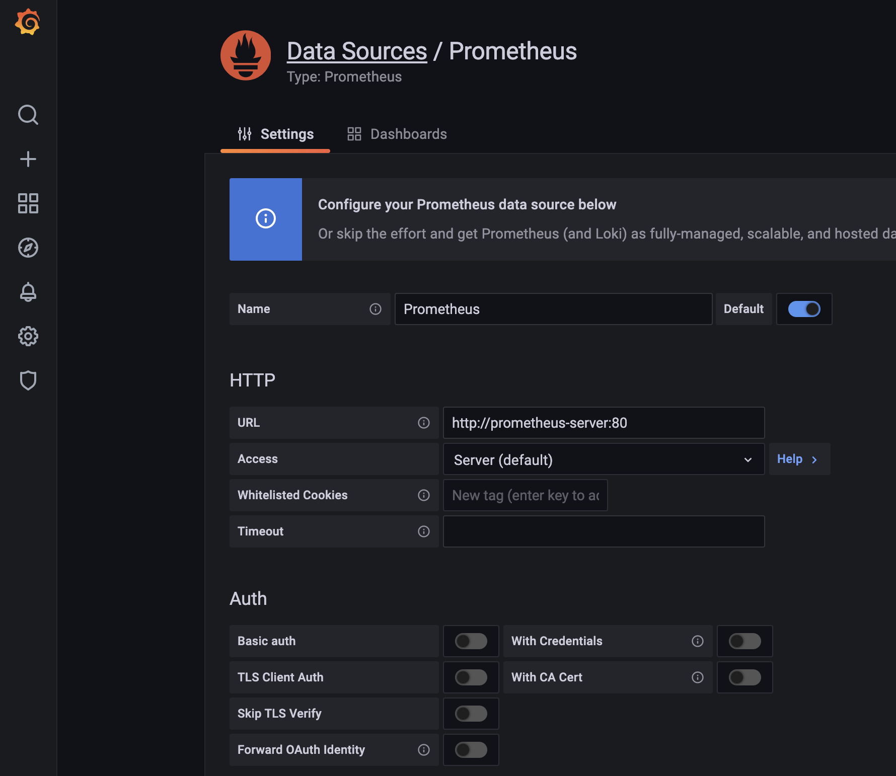
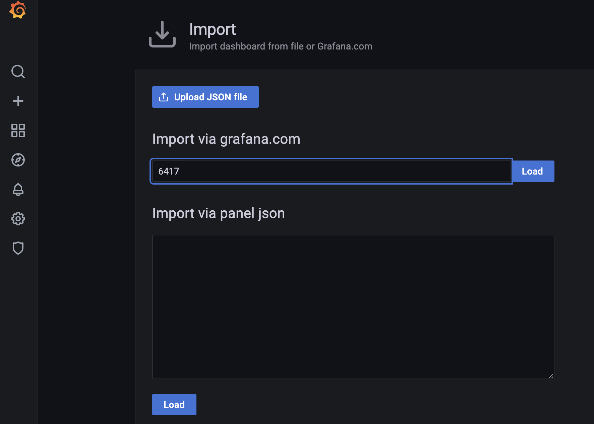
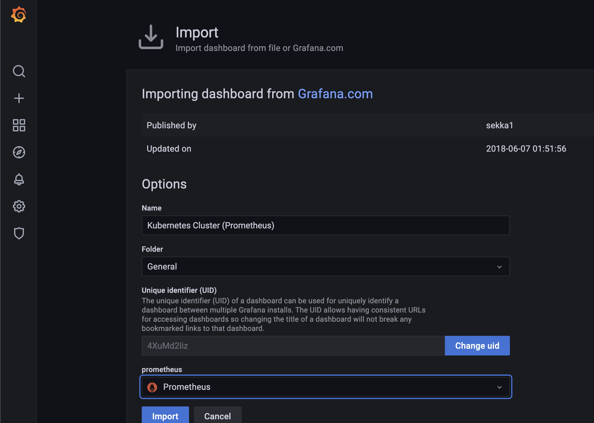
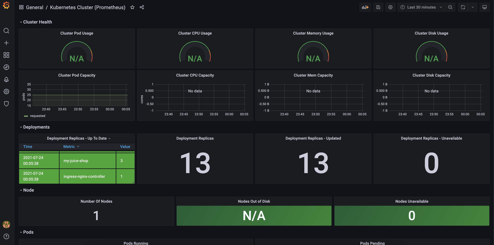
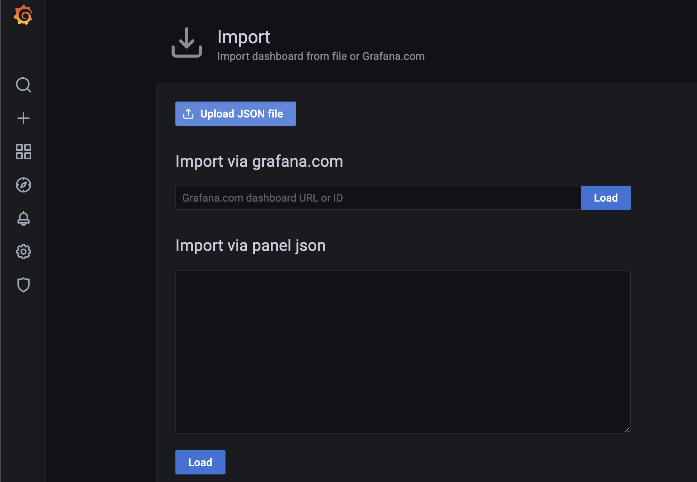
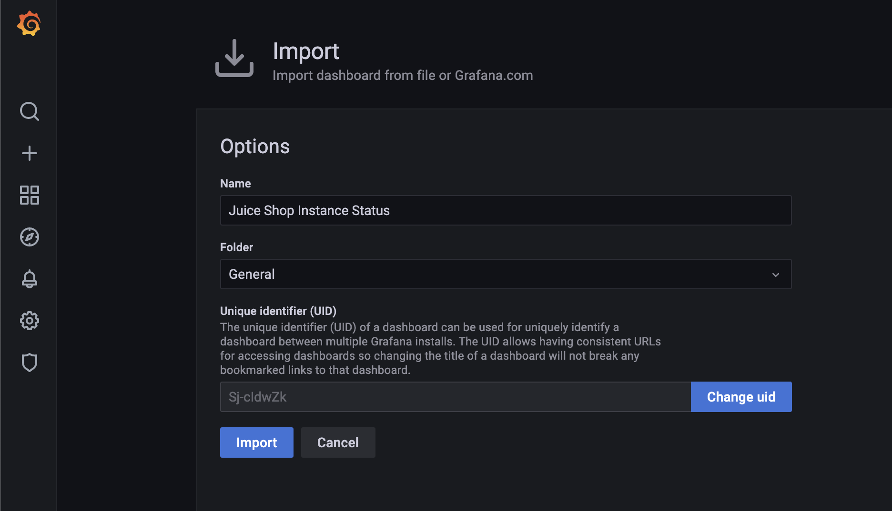
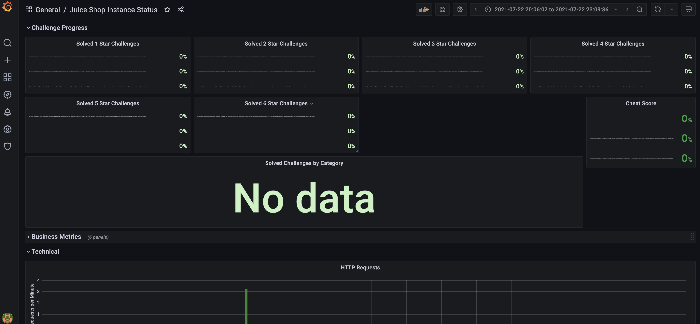
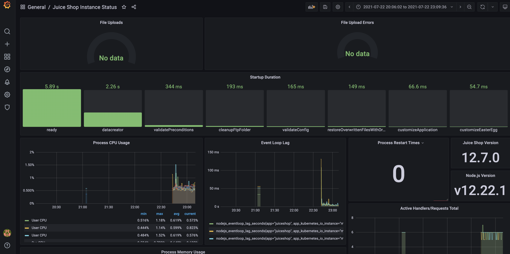

# The Modern Full Life Cycle of a web application
# Scope
Document the needed technical stack, steps, and the code to provision a full life cycle for an already existing web application, to satisfy the modern requirements.

# Intro
The setup is going to be done on a local computer (with macOS in this case) with a local Kubernetes cluster on it.
In a cloud environment the steps will differ.
A production grade system will require a different approach especially in the persistence and the stored secrets security areas.

##Technical stack:
1. Kubernetes (the last version installed by minikube)
2. Helm 3
3. Nginx Ingress Controller
4. Prometheus
5. Grafana 

## Install a Kubernetes cluster on the local machine
To install a Kubernetes cluster on a macOS machine, perform the following steps:
```bash
% curl -LO https://storage.googleapis.com/minikube/releases/latest/minikube-darwin-amd64
% sudo install minikube-darwin-amd64 /usr/local/bin/minikube
% minikube start --driver=hyperkit # the driver option is needed for the Nginx Ingress Controller to work on a minikube on macOS
```

## Deploy the cert-manager
Because the IP we have is not a public one, we can't use the Letsencrypt service to get a CA signed certificate recognized by all the clients.
To solve this problem, we need a way to generate self-signed certificates into the Kubernetes cluster that are available to the Nginx proxy. 
```bash
kubectl create namespace cert-manager
helm repo add jetstack https://charts.jetstack.io
helm repo update
helm install \
  cert-manager jetstack/cert-manager \
  --namespace cert-manager \
  --create-namespace \
  --version v1.4.0 \
  --set installCRDs=true
```

## Deploy the Nginx Ingress Controller
The Nginx controller is in charge of managing the settings of the Nginx proxy we put in front of the Services.
The Nginx proxy is the proxy in front of the services in front of the pods.
```bash
minikube addons enable ingress # The Nginx Ingress Controller has to be enabled this way
# To fix the "endpoints “default-http-backend” not found in Ingress resource" problem in the Ingress resource
kubectl apply -f https://raw.githubusercontent.com/roelal/minikube/5093d8b21c0931a6c63fa448538761b4bf100ee0/deploy/addons/ingress/ingress-rc.yaml
kubectl apply -f https://raw.githubusercontent.com/roelal/minikube/5093d8b21c0931a6c63fa448538761b4bf100ee0/deploy/addons/ingress/ingress-svc.yaml
```

## Deploy the OWASP Juicebox application
OWASP Juicebox web application will be used as an example 
Helm package URL: https://artifacthub.io/packages/helm/securecodebox/juice-shop
To install the app into the Kubernetes cluster perform the following steps:
```bash
ns='demo-web-app'
kubectl create ns $ns
helm repo add securecodebox https://charts.securecodebox.io/
kubectl --namespace $ns apply -f my-juice-shop.yaml
sleep 10 # wait for all the pods to start
kubectl -n $ns apply -f self-singned-cert.yaml # Generate the self signed certificate for the domain and set the Ingress for it.
```
The `my-juice-shop.yaml` template was modified to contain the following:
1. "replicas: 3" - it's the minimum number of replicas to have in a system resembling production requirements. It does not do too much in this case considering there is only one machine in the cluster.
2. added "prometheus.io/scrape: 'true'" to the Service - for the Juicebox metrics to be exposed to the Prometheus, they have to be enabled at the Service level.

## Local DNS resolution
In order to be able to reach the web app via its name and for the self-signed certificate to work, we can add a local DNS entry.
In a production grade environment this has to be done with a fully functional DNS server.
```bash
IP=$(minikube ip)
DNS="demo-webapp.website"
sudo echo $IP $DNS > /etc/hosts
open $DNS
```

## Observability
For simplicity, the stack of choice is going to be Prometheus without persistence and Grafana frontend to it.

### Prometheus setup
Install and expose the Prometheus service port to work with its interface.
```bash
kubectl create namespace monitoring
helm repo add prometheus-community https://prometheus-community.github.io/helm-charts
helm install prometheus prometheus-community/prometheus
kubectl expose service prometheus-server --type=NodePort --target-port=9090 --name=prometheus-server-np
sleep 10
minikube service prometheus-server-np # Open the Prometheus web interface into the browser
```
### Grafana setup
Install and expose the Grafana service port to work with its web interface.
```bash
helm repo add grafana https://grafana.github.io/helm-charts
helm repo update
helm install grafana grafana/grafana
kubectl get secret --namespace default grafana -o jsonpath="{.data.admin-password}" | base64 --decode ; echo # Get the generated Grafana password
kubectl expose service grafana --type=NodePort --target-port=3000 --name=grafana-np
sleep 10
minikube service grafana-np
```
### Setup Prometheus data source in Grafana.
For the Grafana to pull the Prometheus metrics, they have to be connected together.
It's done as see in the Figure 1.1

Figure 1.1

### Setup the Kubernetes dashboard into the Grafana
Figure 1.2 shows how the community version of the Kubernetes dashboard can be loaded.


In the Figure 1.3 can be seen how it is imported and in the Figure 1.4 it can be seen how it looks.

Figure 1.3 

Figure 1.4

The JuiceBox app Grafana dashboard is added differently.
I've got the `grafana-dashboard.json` file from the official repo with
```bash
wget https://raw.githubusercontent.com/bkimminich/juice-shop/master/monitoring/grafana-dashboard.json # Download the Grafana dashboard for Juice shop
```
The 'Upload JSON file' button will be used in this case, as seen in the Figure 1.5

Figure 1.5

After the `grafana-dashboard.json` file from my local computer was imported, I've got the state as seen in the Figure 1.6

Figure 1.6

The Figure 1.7 and 1.8 show how the Juice box dashboard is looking.

Figure 1.7


Figure 1.8

# In the next series
- The Nginx controller has support against the OWASP threats. I will demo how to enable and test the protection against them. Also, I might add a cloud vendor WAF into the game.
- There is place for better automation in regards to the templates generation and most likely the Grafana settings.
- There is a difference in settings for the local Kubernetes and the cloud one. Will add the documentation for how to do it in the cloud and for the production environments, as already mentioned above, with emphasise on data persistence and secrets storage.  